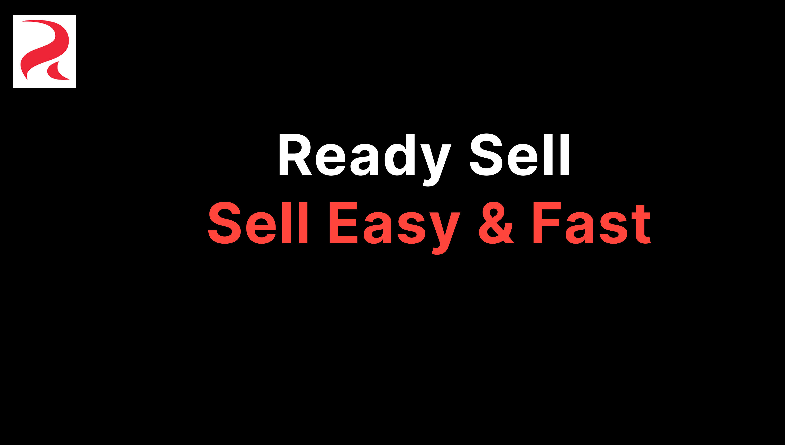
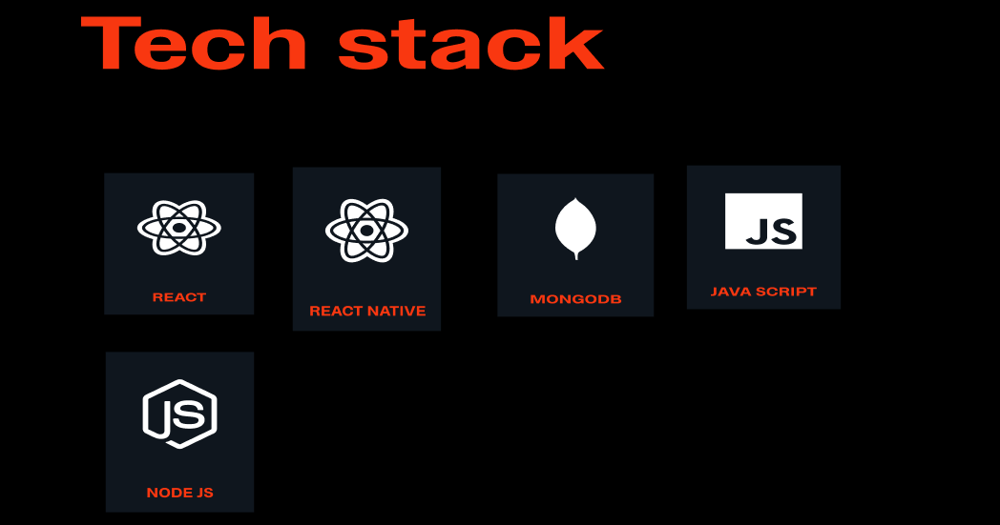
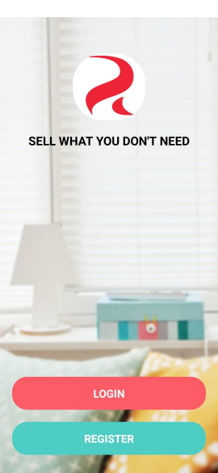
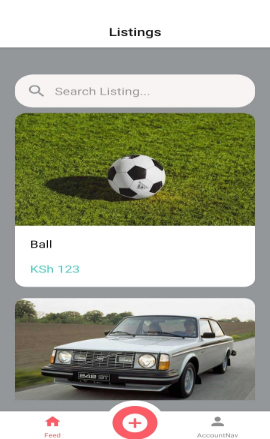
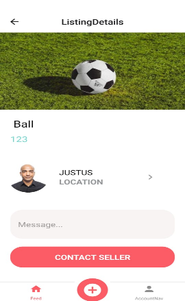

<!-- START doctoc generated TOC please keep comment here to allow auto update -->
<!-- DON'T EDIT THIS SECTION, INSTEAD RE-RUN doctoc TO UPDATE -->
**Table of Contents**  *generated with [DocToc](https://github.com/thlorenz/doctoc)*

- [ReadySell](#readysell)
  - [Inspiration](#inspiration)
  - [Built With](#built-with)
  - [Architecture](#architecture)
  - [Getting Started](#getting-started)
    - [1.Download the app:](#1download-the-app)
    - [2. Clone and Run in Expo Go](#2-clone-and-run-in-expo-go)
  - [Features](#features)
    - [Login/Register](#loginregister)
    - [Listing and AddListing](#listing-and-addlisting)
    - [Messaging and Contacting Seller](#messaging-and-contacting-seller)
  - [API](#api)
  - [Known Issues](#known-issues)
  - [Future](#future)
  - [Attribution:](#attribution)
  - [Author](#author)
    - [Joel Nyaga](#joel-nyaga)

<!-- END doctoc generated TOC please keep comment here to allow auto update -->

# ReadySell



**Readysell** is an android application where users get to post, sell their items on a whim.

The app is designed for android devices and for majorly users who want to sell items without establishing a shop base.

## Inspiration

**I had been looking to make an app where people would communicate at a personal level about their products, that is not necessarily where they need to establish a shop or station to carry out a transaction. With the tools for communication in place that is ,expo notifications, I made it a task to be able to utilize it for this purpose.**

## Built With



## Architecture


## Getting Started

To start using the app you can use two method.Which are to download the app from the link below or follow the steps to run the project on Expo Go android

### 1.Download the app:

[ReadySell.apk](https://drive.google.com/file/d/1ol3f7IWHs544vqlg3DsvtpN7NCBUkf31/view?usp=share_link)

### 2. Clone and Run in Expo Go

- Download [Expo Go](https://play.google.com/store/apps/details?id=host.exp.exponent&pli=1) on android phone.
- Install expo_cli in your local computer(you need node>14+ installed)

  ```bash
  npm install -g expo-cli
  ```

  Clone repo

- ```bash
  git clone https://github.com/JNyaga/ReadySell_Front.git
  ```

  In folder run command

- ```bash
  npx expo install
  npx expo start

  ```

open your **Expo Go** and scan the QRcode generated after above code

## Features

### Login/Register



### Listing and AddListing

- The Listing screen is used to view items that are being sold and see which will peek your interest.
- The AddListing is utilized to post an item you wish to sell

  

### Messaging and Contacting Seller

You can contact a seller of a product and see the messages recieved from buyers and respond to them:



## API

> The api can be accessed from `https://readysell-api.cyclic.app/`

| \***\*Method\*\*** | \***\*URI\*\***       | \***\*Function\*\***                                                                                                       |
| ------------------ | --------------------- | -------------------------------------------------------------------------------------------------------------------------- |
| \***\*GET\*\***    | `/api/categories`     | \***\*Gets the list of all categories stored in the database\*\***                                                         |
| \***\*GET\*\***    | `/api/listing/:id`    | \***\*Get the listing of item with `id\*\***                                                                               |
| \***\*GET\*\***    | `/api/listings`       | \***\*Get the list of all listings stored\*\***                                                                            |
| \***\*POST\*\***   | `/api/listings`       | \***\*Add an item listing\*\***                                                                                            |
| \***\*GET\*\***    | `/api/user/:id`       | \***\*Get a user with the \*\***`id`\***\* given\*\***                                                                     |
| \***\*GET\*\***    | `/api/users`          | \***\*Get a list of all users in the users database\*\***                                                                  |
| \***\*POST\*\***   | `/api/users`          | \***\*Creates a new user if only the user does not exists\*\***                                                            |
| \***\*POST\*\***   | `/api/auth`           | \***\*Creates an authtoken and send it to user for authentication.\*\*** \***\*It acts as a middleware for accessing\*\*** |
| \***\*POST\*\***   | `/api/expoPushTokens` | \***\*store a token that allows users to receive message notifications\*\***                                               |
| \***\*GET\*\***    | `/api/messages`       | \***\*Gets a list of messages for specific user\*\***                                                                      |
| \***\*POST\*\***   | `/api/messages`       | \***\*Create a new message in the message a database and pushes it to specific user\*\***                                  |

## Known Issues

- Profile picture may take a while to load on changing image-> for now clear app cache to see change immediately.
- Since app is not yet registered on google the mapview in`ListingDetail` does not work on standalone apps.

## Future

Beyond this initial MVP which was built in 2 weeks, I would like to continue to add many more features to **ReadySellApp.**

To name a few -> I would like to integrate Aws S3 in my backend to be able to to store and retrieve my images more effectively.

- I would register the app on google playstore so as features such as location mapview to work effectively.

If you have any feedback (ex: feature ideas) or would like to contribute to this project, please feel free to contact me.

## Attribution:

- Bugninza-> youtube channel.
- Zero to mastery-> react native course.

## Author

### Joel Nyaga

[Github](https://github.com/JNyaga) [LinkedIn](https://www.linkedin.com/in/joel-nyaga-muriithi-a3404288)
